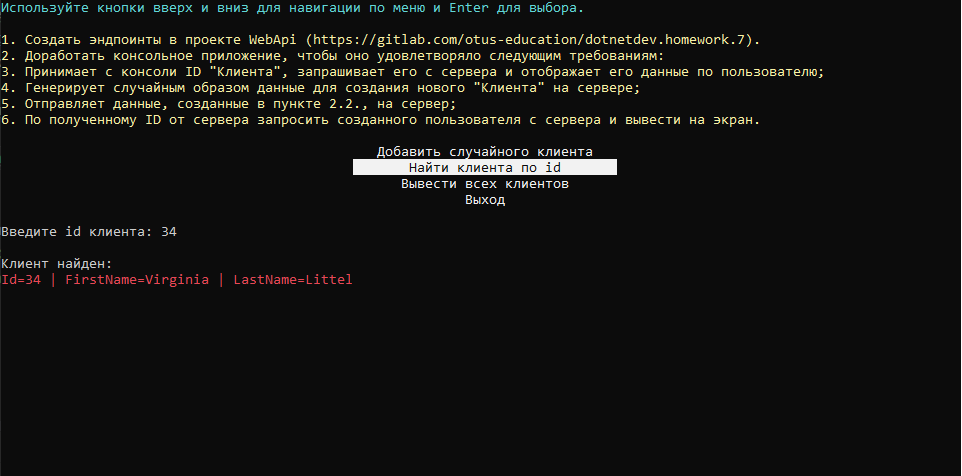

## REST и RESTful API
###### Вебинар от 22.08.23

### Домашнее задание
Добавляем взаимодействие между клиентом и сервером

**Цель**:  
В этой домашней работе мы применим на практике полученные знания по работе с REST API.  
Необходимо будет реализовать два проекта - WebApi и консольный клиент. Консольный клиент должен отправлять в WebApi запрос на сохранение случайным образом сгенерированного пользователя. Сервер, в свою очередь, при добавлении пользователя должен проверять наличие пользователя в БД и возвращать коды ответов:

- 200, если пользователь добавлен без ошибок;
- 409, если пользователь с таким Id уже существует в базе.
Также, должен быть метод получения пользователя по идентификатору, а сервер должен отдавать статус-код 200 с информацией о пользователе, если он есть, либо 404, если пользователь не был найден.

### Описание/Пошаговая инструкция выполнения домашнего задания:
1. Создать эндпоинты в проекте WebApi (https://gitlab.com/otus-education/dotnetdev.homework.7)
2. Доработать консольное приложение, чтобы оно удовлетворяло следующим требованиям:
3. Принимает с консоли ID "Клиента", запрашивает его с сервера и отображает его данные по пользователю;
4. Генерирует случайным образом данные для создания нового "Клиента" на сервере;
5. Отправляет данные, созданные в пункте 2.2., на сервер;
6. По полученному ID от сервера запросить созданного пользователя с сервера и вывести на экран.

### Инструкция запуска

1. Склонируйте приложение и зайдите в проект:  
   `git clone https://github.com/antoha-p/otus-hw2-22.08.23.git && cd otus-hw2-22.08.23`
2. Зайдите в каталог docker, скопируйте .env.example в .env и запустите докер:  
   `cd docker && cp .env.example .env && docker-compose up`
3. Примените миграции:  
   `dotnet ef database update`
4. Откройте решение и запустите проект:

1. Настройки подключения к БД находятся в `App.config` (настроены для .env.example).
2. Классы обработчики для выполнения пунктов задания:
   1. `Menu.Handlers.GetCustomerHandler` - Принимает с консоли ID "Клиента", запрашивает его с сервера и отображает его данные по пользователю.
   2. `Menu.Handlers.CreateFakeCustomerHandler` - Генерирует случайным образом данные для создания нового "Клиента" на сервере.